  

# 🟣 BurpSuite Manager

> 점검 대상마다 Burp 스코프·프록시 설정을 손으로 다시 만드는 일을 없애는 데스크톱 앱

여러 대상의 스코프 규칙을 **마스터 JSON 하나**로 관리하고, 필요한 대상만 골라 **Burp 프로젝트 설정 형식으로 export**합니다. 점검 중 자주 쓰는 내장 도구와 로컬 툴킷 웹뷰를 한 창에 모았습니다.

## 🧩 모듈 구성 (8)

| 모듈 | 하는 일 |
|---|---|
| `DASHBOARD` | 등록된 프로그램·규칙 수를 타일로 요약 |
| `PROGRAMS` | 대상별 frontmatter와 INCLUDE / EXCLUDE 규칙 편집 |
| `PROXY` | 리스너 · 요청/응답 가로채기 · Match/Replace 공통 설정 |
| `TOOLS` | INTRUDER · ENCODE · WEBSHELL 내장 도구 |
| `WEB TOOLS` | 로컬 pentest 툴킷을 WebView2로 임베드 |
| `VALIDATE` | ROE lint — HIGH / MEDIUM / INFO 등급 점검 |
| `IMPORT / EXPORT` | Burp JSON 가져오기 · 폴더 스캔 · 일괄 내보내기 |
| `SETTINGS` | 경로 · 기본값 등 앱 설정 |

## 🔁 스코프 관리 흐름

- **INCLUDE** in-scope 규칙 — 프로토콜 · 호스트(정규식) · 포트 · 파일 경로
- **EXCLUDE** out-of-scope 규칙 — 동일 스키마로 예외 지정
- **LINT** — 내보내기 전 ROE 위반 · 중복 · 과도한 와일드카드를 등급별로 경고

## 🧰 내장 도구 · TOOLS

- **INTRUDER** — Raw 요청에 `§마커§`로 위치를 지정하면 Sniper / Pitchfork / Cluster bomb 공격 Python 스크립트 생성 (RAW=HTTP, 결과=Python 구문 색상 구분)
- **ENCODE** — Base64 · URL · Hex · HTML 엔티티 인코딩/디코딩 + 해시 계산
- **WEBSHELL** — 웹셸 · 리버스 셸 페이로드 생성

## 🌐 로컬 툴킷 · WEB TOOLS

- **임베드** — 로컬 pentest 웹 툴킷을 앱 안에서 사용 (별도 브라우저 불필요)
- **창 분리** — 세션 유지한 채 독립 창으로 분리, 부모 창 최소화해도 유지
- **접속 경로 전환** — 내부 IP ⇄ 도메인(HTTPS), 경로·쿼리 보존, 오리진별 세션 분리
- **TLS 만료 배지** — 인증서 잔여일 표시·D-30 경고, 인증서/DNS 실패 시 내부 IP 자동 폴백
- **모바일/PC 폭 전환** — 반응형 레이아웃 즉시 확인

## 🎨 디자인 규칙

- **강조색 하나** — 퍼플 단색만 강조, 초록·앰버·적색은 상태 표시 전용
- **선보다 면** — 구분선 대신 배경 단차로 영역 분리
- **Cascadia 서체** — UI는 Cascadia Mono, 브랜드·코드는 Cascadia Code
- **크롬리스 창** — OS 타이틀 바 제거·직접 렌더, Win+방향키 스냅·트레이 상주

## 🛠 기술 스택

| | |
|---|---|
| **Runtime** | .NET 8 · WinForms (C#) · WebView2 |
| **Distribution** | self-contained 단일 파일 · win-x64 · 설치 불필요 |
| **규모** | 소스 13개 파일 · 약 7,000줄 |
| **검증** | 내장 selftest 29개 (Burp 스키마 정합·재가져오기 왕복 검사) |

인가된 침투 테스트 업무용 내부 도구입니다.
